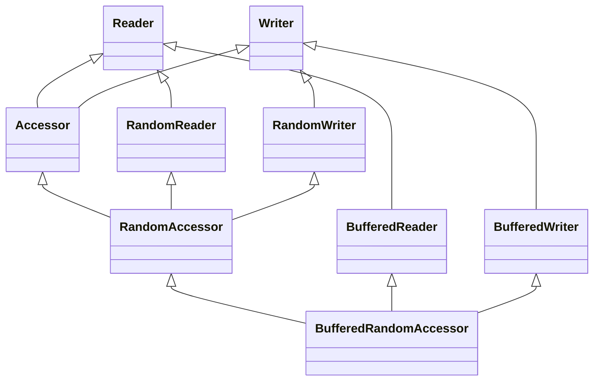

# Multiple Inheritance Example

As an example of multiple inheritance with a combination of data and logic merged across various inheritance branches, I decided to implement a small family of buffered data access primitives.
Below is a class diagram for the framework I want to implement:

For Mermaid diagrams in Markdown:
- https://mermaid.js.org/
- https://marketplace.visualstudio.com/items?itemName=vstirbu.vscode-mermaid-preview
